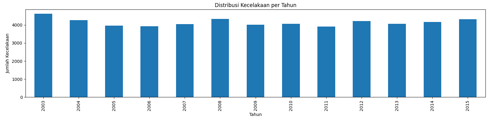
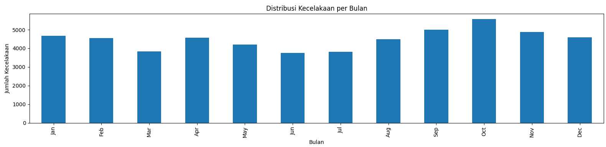
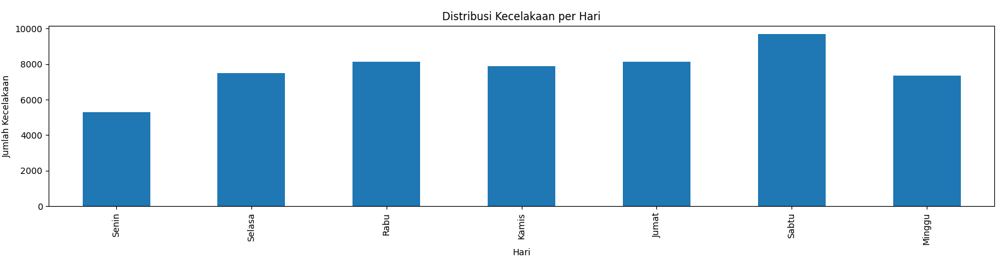
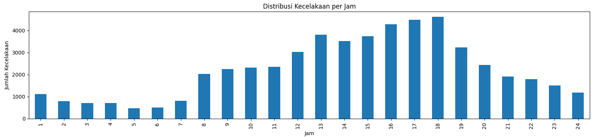
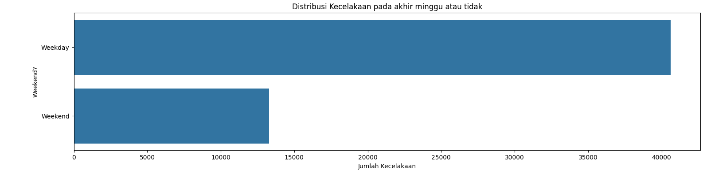
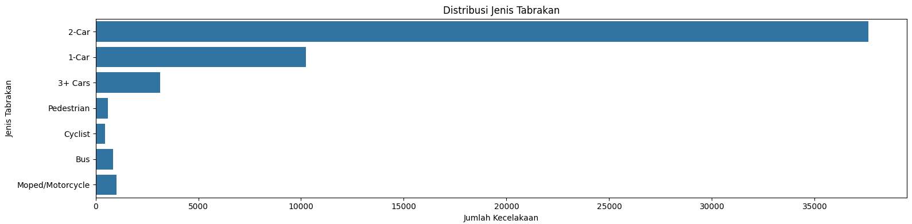
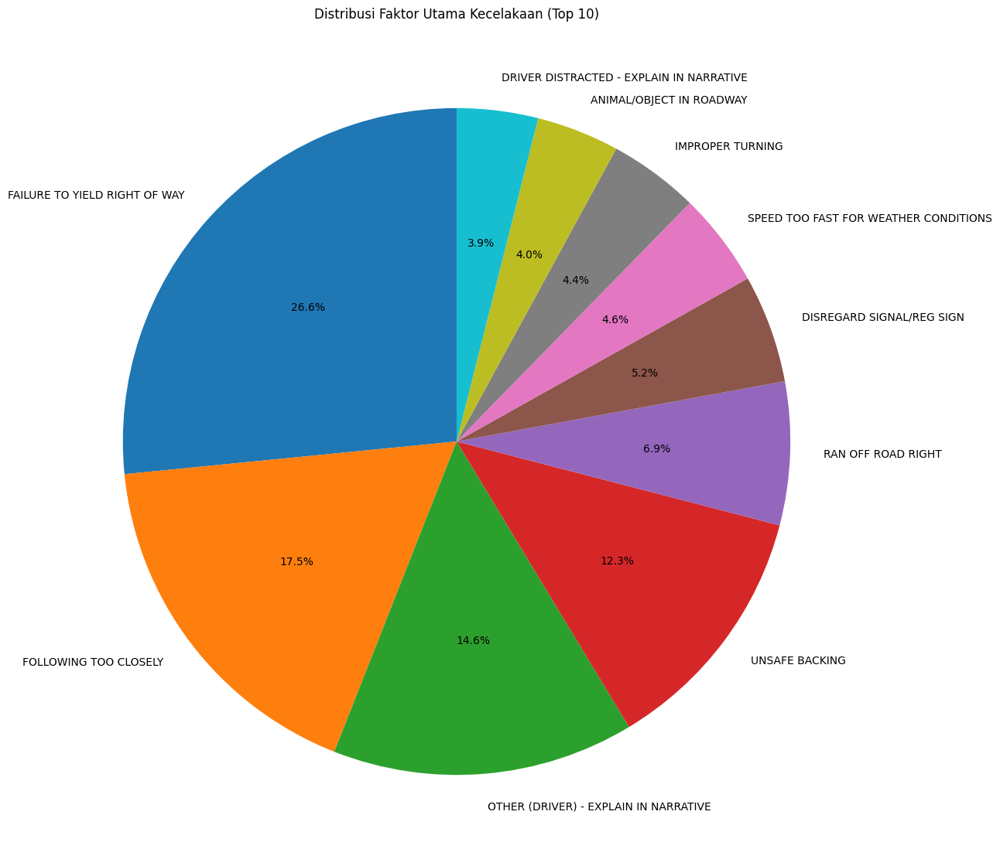
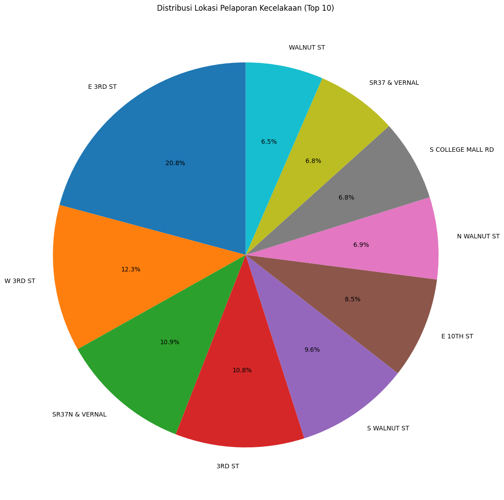
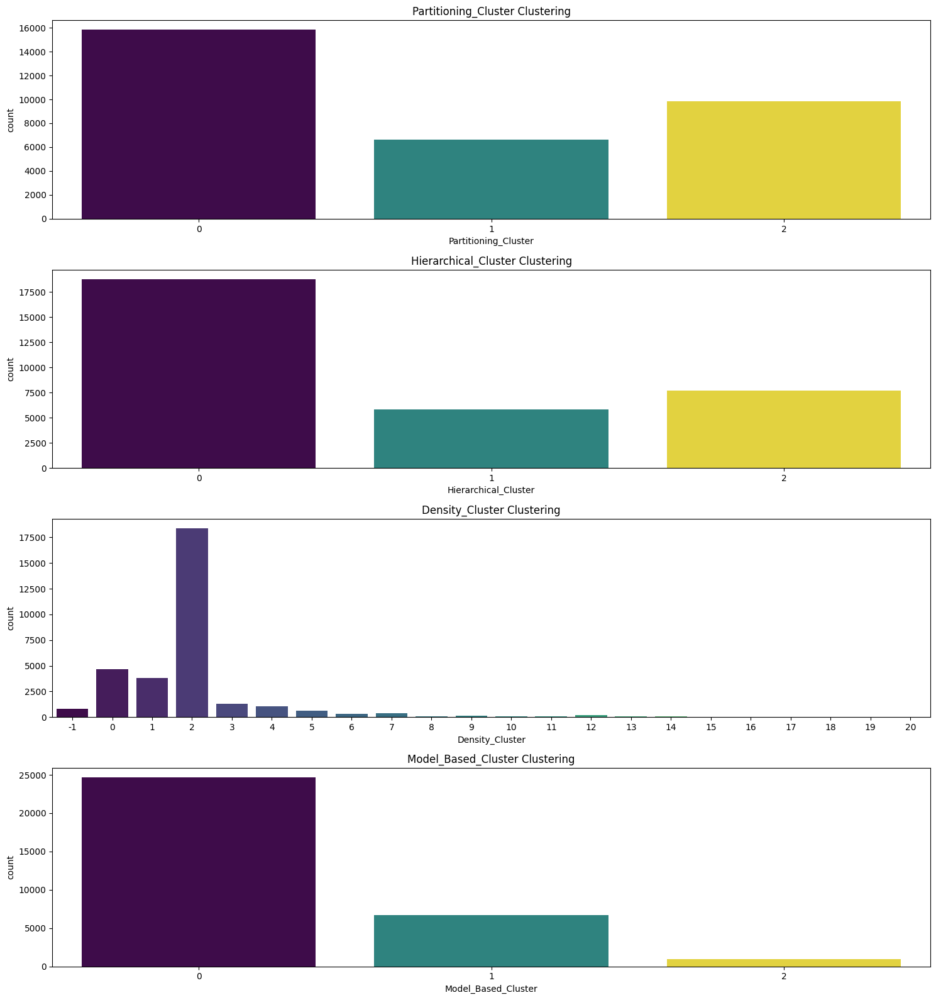

# Laporan Proyek Machine Learning - Masdarul Rizqi
## Domain Proyek - Keamanan Lalu Lintas
Perkembangan Machine Learning yang pesat telah membuka peluang besar bagi manusia untuk menyelesaikan permasalahan rumit melalui komputasi komputer. Pada proyek ini, penggunaan Machine Learning direncanakan untuk melakukan analisis terhadap data kecelakaan lalu lintas.

[Menurut WHO (1984)](https://www.kajianpustaka.com/2020/05/kecelakaan-lalu-lintas.html), kecelakaan lalu lintas merujuk pada kejadian di jalan raya yang setidaknya diakibatkan oleh satu kendaraan, menyebabkan cedera, kerusakan, atau kerugian pada pemiliknya atau korban. Kecelakaan lalu lintas merupakan kejadian yang sulit diprediksi, baik waktu maupun lokasinya. Dampaknya tidak hanya terbatas pada trauma, cedera, atau kecacatan, tetapi juga dapat berujung pada kematian. Kasus kecelakaan sulit untuk ditekan dan cenderung meningkat seiring pertumbuhan panjang jalan dan intensitas pergerakan kendaraan.

Analisis kecelakaan lalu lintas memiliki relevansi yang signifikan dan dampak besar terhadap keselamatan masyarakat. [Menurut WHO](https://www.who.int/health-topics/road-safety#tab=tab_1), kecelakaan lalu lintas menyebabkan kematian sekitar 1,19 juta orang setiap tahunnya secara global, dan antara 20 hingga 50 juta orang mengalami cedera non-fatal. Selain menimbulkan dampak kemanusiaan, kecelakaan juga memberikan dampak ekonomi negatif dengan kerugian mencapai sekitar 3% dari produk domestik bruto tahunan suatu negara. Dengan memahami dan memprediksi faktor-faktor penyebab kecelakaan, langkah-langkah dapat diambil untuk mengurangi kerusakan dan tingkat keparahannya.
### Fakta tentang Kecelakaan Lalu Lintas
Berikut adalah beberapa fakta tentang kecelakaan lalu lintas:
* Kebanyakan kecelakaan lalu lintas terjadi dalam radius 3 mil dari rumah.
* Penyebab paling umum dari kecelakaan lalu lintas adalah distraksi, kelelahan, kondisi lingkungan, dan gangguan medis atau emosional.
* Hampir 1,3 juta orang meninggal setiap tahun akibat kecelakaan lalu lintas.
* Ada sekitar 3.287 kematian akibat kecelakaan lalu lintas setiap hari.
* kecelakaan lalu lintas adalah penyebab kematian nomor 9 di dunia.

Latar belakang relevansi keamanan lalu lintas dengan penggunaan Machine Learning sangat signifikan karena dapat memberikan kontribusi besar dalam upaya pencegahan kecelakaan dan peningkatan keselamatan di jalan raya. Beberapa keuntungan dan solusi yang dapat diberikan oleh proyek ini mencakup:
1.  **Prediksi Kecelakaan**: Machine Learning dapat digunakan untuk menganalisis pola historis kecelakaan lalu lintas berdasarkan data waktu, lokasi, dan faktor-faktor terkait lainnya. Dengan demikian, model dapat memprediksi kemungkinan kejadian kecelakaan di suatu daerah tertentu atau pada waktu tertentu.
2.  **Identifikasi Faktor Risiko**: Algoritma Machine Learning dapat membantu mengidentifikasi faktor-faktor risiko yang berkontribusi pada kecelakaan, seperti kondisi jalan, cuaca, kecepatan kendaraan, dan faktor manusia. Dengan mengetahui faktor-faktor ini, langkah-langkah pencegahan yang lebih spesifik dapat diambil.
3.  **Optimasi Rute dan Pengaturan Lalu Lintas**: Machine Learning dapat digunakan untuk mengoptimalkan rute perjalanan berdasarkan data historis lalu lintas. Sistem cerdas dapat memberikan saran rute alternatif untuk menghindari area yang cenderung memiliki tingkat kecelakaan tinggi.
4.  **Peringatan Dini**: Dengan analisis real-time, sistem Machine Learning dapat memberikan peringatan dini kepada pengemudi atau pihak berwenang tentang kondisi berpotensi berbahaya di jalan raya, seperti kemacetan atau kondisi cuaca ekstrem.
5.  **Pengawasan Kendaraan Mandiri**: Pengembangan kendaraan otonom dan sistem pengawasan pintar berbasis Machine Learning dapat membantu mencegah kecelakaan yang disebabkan oleh kesalahan pengemudi. Teknologi ini dapat mendeteksi objek di sekitar kendaraan dan merespons secara cepat untuk menghindari potensi bahaya.

Dengan memanfaatkan kecerdasan buatan(AI) dalam analisis lalu lintas, proyek ini dapat memberikan solusi yang proaktif dan responsif terhadap situasi di jalan raya, membantu mengurangi kecelakaan, dan secara keseluruhan meningkatkan keselamatan masyarakat.
## *Business Understanding*
Solusi machine learning dapat memberikan kontribusi besar dalam menjawab pertanyaan-pertanyaan terkait kecelakaan lalu lintas. Berikut adalah penjelasan lebih spesifik tentang bagaimana model machine learning akan membantu:
### *Problem Statements*
Pernyataan masalah yang ingin dijawab:
1.  Apa pola waktu (hari, bulan, tahun) dari kecelakaan?
2.  Apa jenis kecelakaan yang paling umum?
3. Faktor utama apa yang berkontribusi terhadap kecelakaan?
4. Bagaimana cara membuat model machine learning untuk mengklaster pola kelompok kecelakaan?
### *Goals*
Tujuan dari pernyataan masalah:
1.  Menentukan pola waktu dari kecelakaan.
2.  Mengidentifikasi jenis kecelakaan yang paling umum.
3.  Mengetahui faktor utama yang berkontribusi terhadap kecelakaan.
4.  Mengembangkan model yang dapat mengklaster pola kelompok kecelakaan.
### *Solution Statements*
Solusi yang diusulkan:
1.  Analisis Pola Waktu Kecelakaan:
    *   Mengumpulkan data historis tentang waktu kecelakaan.
    *   Menganalisis pola waktu (hari, bulan, tahun) kecelakaan.
    *   Visualisasi data untuk mempresentasikan pola tersebut.
2.  Identifikasi Jenis Kecelakaan yang Paling Umum:
    *   Mengumpulkan data tentang jenis dan keparahan kecelakaan.
    *   Menganalisis frekuensi jenis kecelakaan.
    *   Visualisasi data untuk mempresentasikan hasil analisis
3.  Faktor Utama yang Berkontribusi terhadap Kecelakaan:
    *   Mengumpulkan data tentang faktor utama kecelakaan.
    *   Menganalisis frekuensi faktor utama kecelakaan.
    *   Visualisasi data untuk mempresentasikan hasil analisis.
4.  Pengembangan Model Machine Learning:
    *   Identifikasi dan pertahankan atribut yang relevan.
    *   Lakukan subset data, encoding, dan scaling.
    *   Terapkan algoritma pengelompokan (K-Means, Hierarchical Clustering, DBSCAN, dan GMM.)
    *   Evaluasi performa
## *Data Understanding*
Dataset yang digunakan dalam proyek ini berasal dari [data kecelakaan mobil](https://www.kaggle.com/datasets/jacksondivakarr/car-crash-dataset/data) yang diunduh dari platform kaggle.com dan dipublikasikan oleh Jackson Divakar R. Dataset ini memberikan informasi terperinci mengenai faktor-faktor umum yang memengaruhi kecelakaan di jalan raya, seperti tingkat keparahan tabrakan, kondisi cuaca, jenis jalan, dan elemen-elemen lain yang berkontribusi. Informasi ini memberikan wawasan berharga untuk analisis dan peningkatan langkah-langkah keselamatan jalan raya secara keseluruhan. 
Table 1. Atribut pada _Car Crash Dataset_
Atribut  | Keterangan | Tipe Data |
------------- | ------------- | --------------|
_Year_ | merepresentasikan tahun kejadian tabrakan | _integer_|
_Month_ | merepresentasikan bulan kejadian tabrakan | _integer_ |
_Day_ | merepresentasikan hari kejadian tabrakan | _integer_ |
_Weekend?_ | merepresentasikan apakah tabrakan terjadi di akhir pekan atau bukan | _object_ |
_Hour_ | merepresentasikan jam kejadian tabrakan. | _float_ |      
_Collision Type_ | merepresentasikan jenis tabrakan | _object_ |
_Injury Type_  | merepresentasikan jenis cedera | _object_ |
_Primary Factor_ |merepresentasikan faktor utama penyebab tabrakan | _object_ |
_Reported_Location_ |merepresentasikan lokasi kejadian tabrakan | _object_ |
_Latitude_ |merepresentasikan garis lintang lokasi kejadian | _float_ | 
_Longitude_ |merepresentasikan garis bujur lokasi kejadian | _float_ | 

Pada _dataset_ berisikan informasi sebanyak 53943 data dengan 11 kolom serta 68 data _Weekend?_, 225 data _Hour_, 6 data _Collision Type_, 1121 data _Primary Factor_, 35 data _Reported_Location_, 30 data _Latitude_ dan _Longitude_ terdapat _missing values_ serta 64 data duplikat.
### Visualisasi Data
Visualisasi persebaran data kecelakaan menunjukkan tren dan pola yang dapat memberikan wawasan penting terkait dengan kejadian kecelakaan lalu lintas. Berikut ini adalah visualisasi persebaran data kecelakaan untuk atribut tahun, bulan, hari, dan jam.
1.  Persebaran Kecelakaan Berdasarkan Tahun:
    *   Grafik persebaran kecelakaan per tahun menunjukkan fluktuasi jumlah kecelakaan dari tahun 2003 hingga 2015. Peningkatan pada beberapa tahun tertentu dapat mengindikasikan periode tertentu dengan risiko lalu lintas yang lebih tinggi, sebagaimana dapat dilihat pada Gambar.1 
     
    Gambar 1, Distribusi kecelakaan pertahun  
    Pada Gambar 1, Sebagian besar kecelakaan pada tahun 2003.
2.  Persebaran Kecelakaan Berdasarkan Bulan:
    *   Grafik persebaran kecelakaan per bulan memberikan gambaran tentang pola musiman kecelakaan. Terlihat bahwa bulan Oktober memiliki jumlah kecelakaan tertinggi, sementara bulan Juni memiliki jumlah kecelakaan terendah, sebagaimana dapat dilihat pada Gambar 2. 
     
    Gambar 2, Distribusi kecelakaan perbulan  
    Pada Gambar 2, sebagian besar kecelakaan pada bulan Oktober.
3.  Persebaran Kecelakaan Berdasarkan Hari:
    *   Grafik persebaran kecelakaan per hari menggambarkan variabilitas kecelakaan dalam seminggu. Analisis ini dapat membantu dalam menentukan apakah hari tertentu memiliki risiko kecelakaan yang lebih tinggi, sebagaimana dapat dilihat pada Gambar 3. 
     
    Gambar 3, Distribusi kecelakaan perhari  
    Pada Gambar 3, sebagian besar kecelakaan pada hari Sabtu.
4.  Persebaran Kecelakaan Berdasarkan Jam:
    *   Grafik persebaran kecelakaan per jam menyoroti waktu-waktu tertentu dalam sehari yang mungkin memiliki tingkat kecelakaan yang lebih tinggi, sebagaimana dapat dilihat pada Gambar 4 
     
    Gambar 4, Distribusi kecelakaan perjam  
    Pada Gambar 4, sebaian besar kecelakaan pada jam 18 atau 6pm.
5.  Persebaran Kecelakaan Berdasarkan Weekend dan Weekday:
    *   Grafik persebaran antara weekend dan weekday membedakan kecelakaan yang terjadi selama hari kerja dan akhir pekan, sebagaimana dapat dilihat pada Gambar 5. 
     
    Gambar 5, Distribusi kecelakaan berdasarkan weekend atau tidak  
    Pada Gambar 5, Sebagian besar Kecelakaan pada Weekday.
6.  Persebaran Tipe Kecelakaan:
    *   Grafik persebaran jenis tabrakan memberikan informasi tentang jenis kecelakaan yang paling umum, sebagaimana dapat dilihat pada Gambar 6 
     
    Gambar 6, Distribusi tipe kecelakaan  
    Pada Gambar 6, sebagian besar kecelakaan 2 mobil, atau tabrakan sesama mobil.
7.  10 Faktor Utama Penyebab Kecelakaan:
    *   Grafik 10 faktor utama penyebab kecelakaan memberikan wawasan tentang faktor-faktor yang paling sering berkontribusi pada kecelakaan, sebagaimana dapat dilihat pada Gambar 7. 
     
    Gambar 7, 10 faktor utama penyebab kecelakaan  
    Pada Gambar 7, sebagian besar kecelakaan pada faktor Kegagalan untuk menghasilkan jalan yang benar
8.  10 Lokasi Tertinggi Kecelakaan Terjadi:
    *   Grafik 10 lokasi tertinggi kecelakaan menyoroti area-area dengan jumlah kecelakaan tertinggi, sebagaimana dapat dilihat pada Gambar 8 
     
    Gambar 8, 10 lokasi tertinggi kecelakaan terjadi  
    Pada Gambar 8, sebagian besar kecelakaan dilokasi E 3RD ST

Melalui visualisasi ini, pola dan faktor-faktor yang dapat diidentifikasi menjadi dasar untuk pengembangan strategi pencegahan dan peningkatan keselamatan lalu lintas. Analisis mendalam terhadap tren, seperti fluktuasi tahunan, pola musiman, variabilitas harian, serta penekanan pada jenis kecelakaan dan faktor penyebabnya, dapat memberikan pemahaman yang lebih baik tentang risiko lalu lintas. Dengan demikian, informasi ini dapat digunakan sebagai landasan untuk pengembangan kebijakan dan tindakan konkret guna mengurangi kecelakaan serta meningkatkan keselamatan di jalan raya.
## Data Preparation
Dalam tahap pembersihan data, terdapat dua proses utama yang dilakukan pada dataset Monroe County Car Crash 2003-2015.
1.  Duplikasi Data 
    Berdasarkan hasil pemeriksaan, terdapat 64 baris data duplikat, kemudian dihapus menggunakan fungsi `drop_duplicates()` yang dapat dilihat pada Tabel 2. 
    Tabel 2. Jumlah Duplikasi Data
    | Nama Data | Duplikasi | Duplikasi Tersisa |
    |------|-----------|-------------------|
    | _monroe county car crach 2003-2015_ | 64  | 0 |
    
    Penghapusan ini dilakukan untuk memastikan bahwa setiap baris dalam dataset bersifat unik, mencegah potensi bias dan distorsi dalam hasil analisis. Dengan demikian, integritas dan konsistensi data dapat dijaga secara optimal. Pemilihan metode `drop_duplicates()` dilakukan karena kesederhanaan dan keterbacaan kode, memberikan implementasi yang efisien dan cepat eksekusi pada operasi penghapusan duplikat. Keputusan ini juga konsisten dengan praktik umum dalam analisis data menggunakan pandas.
2.  *Missing value*  
    Berdasarkan hasil pemeriksaan, terdapat beberapa missing value pada beberapa atribut yang dapat dilihat pada Tabel 3. 
    Tabel 3. Jumlah nilai data yang hilang
     _Attribute_  | _Missing Value_ | _Missing Value_ Tersisa
    ------------- | ------------- | ------------------
    _Year_ | 0 | 0
    _Month_ | 0 | 0
    _Day_ | 0 | 0
    _Weekend?_ | 68 | 0
    _Hour_ | 225 | 0      
    _Collision Type_ | 6 | 0
    _Injury Type_  | 0 | 0
    _Primary Factor_ | 1121 | 0
    _Reported_Location_ | 35 | 0
    _Latitude_ | 30 | 0
    _Longitude_ | 30 | 0

    Penanganan Nilai Kosong
    Penggunaan median dipilih untuk menjaga konsistensi dan menghindari potensi distorsi data akibat imputasi nilai yang mungkin tidak sesuai. Proses ini diperlukan agar dataset menjadi lebih lengkap dan siap untuk tahap analisis lebih lanjut. Pemilihan median dibandingkan dengan mean bertujuan untuk meminimalkan potensi distorsi akibat outlier dan menjaga konsistensi data. Secara keseluruhan, pembersihan data ini penting untuk memastikan dataset yang digunakan dalam analisis selanjutnya lengkap, konsisten, dan siap digunakan.
### Subset Data, Encoding, dan Scaling
<ol type="a">
    <li>Pembentukan Subset Data 
    Untuk membentuk subset data, dipilih kolom-kolom tertentu, yaitu Hour, Collision Type, Injury Type, dan Primary Factor. Langkah selanjutnya, dilakukan pengambilan sebagian sampel (60%) dari subset data tersebut menggunakan metode pengambilan sampel acak (random sampling) dengan seed (random_state) 42. Pemilihan subset data dan pengambilan sampel dilakukan dengan tujuan mengurangi ukuran dataset karena sistem tidak memiliki cukup memori untuk menangani ukuran data atau array dengan 100% sampel. Tindakan ini juga bertujuan memudahkan proses analisis data dan dapat membantu mengatasi masalah keterbatasan sumber daya komputasi. Dengan demikian, proses ini akan menghasilkan subset yang representatif dan lebih efisien untuk analisis selanjutnya.</li>    
    <li>Proses Encoding 
    Selanjutnya, dilakukan proses encoding menggunakan LabelEncoder untuk mengubah nilai-nilai pada kolom-kolom kategorikal menjadi nilai numerik. Langkah ini diperlukan agar model machine learning dapat memahami dan memproses data kategorikal dengan lebih efektif. Melalui LabelEncoder, setiap nilai unik pada kolom kategorikal akan diberikan label numerik yang bersifat representatif. Proses ini bertujuan untuk meningkatkan kemampuan model dalam memahami pola dan hubungan antaratribut pada dataset. Dengan demikian, data yang semula bersifat kategorikal dapat diintegrasikan ke dalam model machine learning dengan lebih baik.</li>    
    <li>Proses Scaling 
    Selanjutnya, dilakukan proses scaling menggunakan StandardScaler. Scaling bertujuan untuk menormalkan skala nilai-nilai pada dataset, sehingga perbedaan skala antar atribut tidak mempengaruhi performa algoritma machine learning yang akan digunakan. Dengan menggunakan StandardScaler, setiap atribut akan diubah sedemikian rupa sehingga memiliki mean 0 dan deviasi standar 1. Hal ini membantu algoritma machine learning dalam mengatasi sensitivitas terhadap perbedaan skala, memperbaiki konvergensi algoritma, dan meningkatkan performa model secara keseluruhan. Proses scaling menjadi langkah kritis untuk memastikan bahwa atribut-atribut pada dataset memiliki pengaruh yang seimbang terhadap hasil prediksi model.</li>    
</ol>

## Modeling
Algoritma pada Machine Learning yang digunakan antara lain :
*   **Partisi Klaster (K-Means Clustering)** 
    Algoritma ini beroperasi dengan memulai setiap titik data dalam kluster terpisah dan secara iteratif menggabungkan kluster yang paling dekat satu sama lain hingga jumlah kluster yang diinginkan tercapai. Dalam implementasi ini, digunakan modul `sklearn.cluster.AgglomerativeClustering` dengan parameter `n_clusters=3`, menunjukkan bahwa data akan dibagi menjadi tiga kluster. Melalui penggunaan algoritma pengelompokan hirarkis, struktur hierarkis dalam data dapat diperoleh, di mana setiap kluster dapat berkaitan dengan kluster lainnya dalam berbagai tingkatan. Proses ini membantu dalam mengidentifikasi pola hierarkis atau hubungan yang ada dalam dataset.
*   **Pengelompokan Hirarkis (Agglomerative Clustering)** 
    Algoritma ini beroperasi dengan memulai setiap titik data dalam kluster terpisah dan secara iteratif menggabungkan kluster yang paling dekat satu sama lain hingga jumlah kluster yang diinginkan tercapai. Dalam implementasi ini, digunakan modul `sklearn.cluster.AgglomerativeClustering` dengan parameter `n_clusters=3`, menandakan bahwa data akan dibagi menjadi tiga kluster. Melalui penggunaan algoritma pengelompokan hirarkis, struktur hierarkis dalam data dapat diperoleh, di mana setiap kluster dapat berkaitan dengan kluster lainnya dalam berbagai tingkatan. Proses ini membantu dalam mengidentifikasi pola hierarkis atau hubungan yang terdapat dalam dataset.
*   **Pengelompokan Berbasis Kepadatan (DBSCAN)** 
    Algoritma ini bekerja dengan mengelompokkan titik data yang dekat dalam ruang fitur menjadi kluster. Pada implementasi ini, modul `sklearn.cluster.DBSCAN` digunakan dengan parameter `eps=0.5`, yang menentukan jarak maksimum antara dua sampel agar satu dapat dianggap berada di lingkungan yang sama. Selain itu, parameter `min_samples=20` menentukan jumlah minimum sampel dalam lingkungan untuk membentuk kluster. DBSCAN sangat berguna untuk mengidentifikasi kluster berbentuk yang kompleks dan tidak terikat pada jumlah kluster sebelumnya. Algoritma ini dapat menangani data dengan kepadatan yang berbeda di berbagai bagian ruang fitur. Hasilnya dapat membantu mengidentifikasi titik data yang berada dalam kelompok yang padat dan titik data yang mungkin menjadi outlier.
*   **Pengelompokan Berbasis Model (Gaussian Mixture Model)** 
    Algoritma ini bekerja dengan mengasumsikan bahwa semua data berasal dari campuran distribusi Gaussian. Pada implementasi ini, modul `sklearn.mixture.GaussianMixture` digunakan dengan parameter `n_components=3`, yang mengindikasikan bahwa diasumsikan ada tiga komponen Gaussian dalam data. Selain itu, parameter `random_state=42` digunakan untuk memastikan hasil yang konsisten. Gaussian Mixture Model (GMM) cocok untuk mengidentifikasi pola data yang mungkin berasal dari campuran distribusi Gaussian. Pengelompokan berbasis model ini berguna ketika data memiliki distribusi yang kompleks dan tidak dapat diwakili dengan baik oleh metode pengelompokan yang sederhana.

K-Means Clustering memiliki kelebihan dalam kemudahan implementasi dan cocok untuk dataset besar, tetapi kekurangannya terletak pada sensitivitas terhadap inisialisasi centroid awal. Sementara itu, Hierarchical Clustering menghasilkan dendrogram yang membantu interpretasi namun memerlukan komputasi intensif, lebih cocok untuk dataset kecil hingga menengah. DBSCAN dapat menangani klaster berbentuk kompleks dan mengidentifikasi noise, namun sensitif terhadap parameter dan kurang cocok untuk dataset dengan variasi densitas yang signifikan. Gaussian Mixture Model memiliki fleksibilitas dalam menangani distribusi non-sferis, tetapi sensitif terhadap inisialisasi parameter. Hasil dari setiap model dapat dilihat pada Gambar 9. 
 
Gambar 9. Hasil setiap model  
Pada Gambar 9, Clustering.
## Evaluation
### Metrik Evaluasi yang Digunakan:
Ketika berurusan dengan tugas *clustering*, metrik evaluasi menjadi lebih subjektif dan bergantung pada tujuan analisis data. Dalam proyek ini, menggunakan beberapa metrik berikut:
1.  **Silhouette Score:**
    *   **Deskripsi** : Mengukur seberapa dekat setiap titik data dalam sebuah kluster dengan titik-titik dalam kluster yang sama dibandingkan dengan kluster lainnya.
    *   **Keuntungan**: Rentang nilai dari -1 hingga 1, di mana nilai yang lebih tinggi menunjukkan kluster yang lebih baik.
    *   **Formula** : 
    
    $$S(i) = \frac{b(i) - a(i)}{\max\{a(i), b(i)\}}$$
    di mana $a(i)$ adalah jarak rata-rata objek ke objek lain dalam kluster yang sama, dan $b(i)$ adalah jarak rata-rata objek ke objek terdekat dalam kluster tetangga (kluster selain kluster objek tersebut).
2.  **Davies-Bouldin Index:**
    *   **Deskripsi**: Mengukur seberapa baik kluster terpisah satu sama lain. Nilai yang lebih rendah menunjukkan kluster yang lebih baik.
    *   **Keuntungan**: Memperhitungkan seberapa baik kluster terpisah dan seberapa seragam ukuran kluster.
    *   **Formula**: 
    
    $$CH = \frac{SSB / (k-1)}{SSW / (n-k)}$$
    di mana $SSB$ adalah variasi antara kluster, $SSW$ adalah variasi dalam kluster, $k$ adalah jumlah kluster, dan $n$ adalah jumlah sampel.
### Hasil Proyek Berdasarkan Metrik Evaluasi:
*   **_Silhouette Score_:**
    *  KMeans: \(0.3300\)
    * Agglomerative Clustering: \(0.3138\)
    * DBSCAN: \(0.0982\)
    * Gaussian Mixture Model: \(0.3733)
*   **_Calinski-Harabasz Index_:**
    * KMeans: \(10734.5449\)
    * Agglomerative Clustering: \(8588.1148\)
    * DBSCAN: \(1358.9695\)
    * Gaussian Mixture Model: \(6163.6951\)

Evaluasi klasterisasi menggunakan metrik Silhouette Score dan Calinski-Harabasz Index memberikan wawasan yang berbeda terkait kualitas klasterisasi dari empat metode yang digunakan (KMeans, Agglomerative Clustering, DBSCAN, dan Gaussian Mixture Model).
    
1.  **Silhouette Score:**
    1.  **Interpretasi Hasil:**
        *  Nilai Silhouette Score untuk Gaussian Mixture Model adalah yang tertinggi (`0.3733`), menunjukkan bahwa metode ini memberikan pembagian klaster yang baik, dan objek dalam klaster memiliki jarak yang baik dengan objek di klaster lain.
        *   Meskipun KMeans (`0.3300`) juga memiliki nilai yang baik, Agglomerative Clustering (`0.3138`) berada di antara KMeans dan DBSCAN (`0.0982`).
        *   DBSCAN memiliki nilai Silhouette Score yang rendah, menunjukkan adanya tumpang tindih antar klaster atau objek yang mungkin ditempatkan di klaster yang salah.
    2. **Implikasi Praktis:**
        *   Tingginya Silhouette Score pada Gaussian Mixture Model menunjukkan bahwa model ini dapat digunakan dengan percaya diri untuk membagi data menjadi klaster yang bermakna. Oleh karena itu, dalam konteks aplikasi praktis, penggunaan Gaussian Mixture Model dapat memberikan hasil klasterisasi yang lebih baik dalam hal keseragaman antar klaster.
2.  **Calinski-Harabasz Index:**
    1.  **Interpretasi Hasil:**
        *   Nilai Calinski-Harabasz Index tertinggi diperoleh oleh KMeans (`10734.5449`), mengindikasikan bahwa rasio dispersi antara klaster dan dispersi dalam klaster pada KMeans lebih baik dibandingkan metode lain.
        *   Agglomerative Clustering memiliki nilai yang tinggi (`8588.1148`), tetapi lebih rendah dibandingkan dengan KMeans.
        *   DBSCAN memiliki nilai yang jauh lebih rendah (`1358.9695`), menunjukkan bahwa metode ini mungkin tidak sesuai dengan struktur data secara keseluruhan.
        *   Gaussian Mixture Model (`6163.6951`) berada di antara Agglomerative Clustering dan DBSCAN dalam hal indeks ini.
    2.  **Implikasi Praktis:**
        *   Meskipun KMeans memiliki nilai Calinski-Harabasz Index tertinggi, pilihan antara KMeans dan Gaussian Mixture Model bergantung pada konteks aplikasi dan sifat data. KMeans cenderung menghasilkan klaster yang kompak, sedangkan Gaussian Mixture Model lebih fleksibel dan dapat menangani klaster dengan bentuk yang berbeda.

## **Kesimpulan:**
Pengembangan Strategi Pencegahan yang Terarah:
1.  Berdasarkan analisis pola waktu kecelakaan, pihak berwenang dapat mengembangkan strategi pencegahan yang lebih terarah. Misalnya, pada tahun-tahun tertentu dengan peningkatan kecelakaan, dapat dilakukan kampanye keselamatan khusus atau peningkatan pengawasan pada periode tersebut.
2.  Intervensi Khusus untuk Jenis Kecelakaan yang Paling Umum: Informasi tentang jenis kecelakaan yang paling umum dapat digunakan sebagai landasan untuk pengembangan program keselamatan yang spesifik. Intervensi seperti peningkatan kesadaran pengemudi, peningkatan infrastruktur jalan, atau implementasi teknologi keamanan khusus dapat diarahkan pada jenis kecelakaan tersebut.
3.  Penyuluhan dan Pendidikan Masyarakat: Faktor utama penyebab kecelakaan yang diidentifikasi dapat menjadi fokus penyuluhan dan pendidikan masyarakat. Kampanye penyadaran dapat dirancang untuk mengurangi perilaku berisiko atau meningkatkan pemahaman tentang dampak dari faktor-faktor tertentu.
4.  Evaluasi Periodik dan Pembaruan Model: Model machine learning perlu dievaluasi secara berkala, terutama jika ada perubahan signifikan dalam pola kecelakaan atau faktor kontributornya. Pembaruan model dapat mencakup penambahan atribut baru atau penyesuaian parameter untuk memastikan relevansi dan kehandalan model.
5.  Kolaborasi dengan Pihak Terkait: Melibatkan pihak berwenang, ahli keselamatan lalu lintas, dan komunitas lokal dalam proses pengembangan kebijakan dan implementasi langkah-langkah pencegahan. Kolaborasi yang kuat dapat meningkatkan efektivitas langkah-langkah yang diambil.
6.  Monitoring dan Evaluasi Implementasi: Setelah implementasi langkah-langkah pencegahan, perlu dilakukan pemantauan dan evaluasi untuk menilai dampaknya. Pengumpulan data lanjutan dapat membantu menentukan apakah langkah-langkah yang diambil telah berhasil atau perlu penyesuaian lebih lanjut.

Sejauh Mana Model Machine Learning Dapat Diandalkan atau Relevan:
*   Model machine learning, terutama Gaussian Mixture Model (GMM) dan KMeans, dapat diandalkan dalam mengklaster pola kelompok kecelakaan. Meskipun tidak mungkin untuk memberikan prediksi pasti, model dapat memberikan wawasan mendalam berdasarkan data yang ada.
*   Keandalan model tergantung pada kualitas dan representativitas data yang digunakan untuk pelatihan. Oleh karena itu, perlu diperhatikan bahwa model hanya sebaik data yang digunakan untuk melatihnya.
*   Relevansi model dalam konteks keamanan lalu lintas dapat diukur melalui evaluasi kinerja menggunakan metrik seperti Silhouette Score dan Calinski-Harabasz Index. Jika model mendapatkan skor tinggi dalam evaluasi, itu menunjukkan bahwa model memberikan klaster yang baik dan dapat membantu dalam pemahaman pola kecelakaan. Namun, keputusan akhir sebaiknya didasarkan pada kombinasi hasil analisis model dan penilaian ahli terkait.
## Referensi

[1] Bachani, A. M., Peden, M., Gururaj, G., Norton, R., & Hyder, A. A. (2017). Road Traffic Injuries. Disease Control Priorities, Third Edition, 20. https://ora.ox.ac.uk/objects/uuid:4f270f40-cd2c-4c03-8c9b-69b061e05243/download_file?file_format=application%2Fpdf&safe_filename=DCP3%2BInjury%2B%26%2BEnvironment_Ch3.pdf&type_of_work=Book+section

[2] Machine Learning Terapan, Dicoding, Diakses 12 Januari 2024 dari : https://www.dicoding.com/academies/319/tutorials/17052.

[3] Road traffic injuries, World Health Organization (WHO), Diakses 13 Januari 2024 dari . Available: https://www.who.int/health-topics/road-safety#tab=tab_1.

[4] "Traffic accident analysis using machine learning paradigms," Academia.edu. Diakses 13 Januari 2024 dari : https://www.academia.edu/30084706/Traffic_accident_analysis_using_machine_learning_paradigms.
